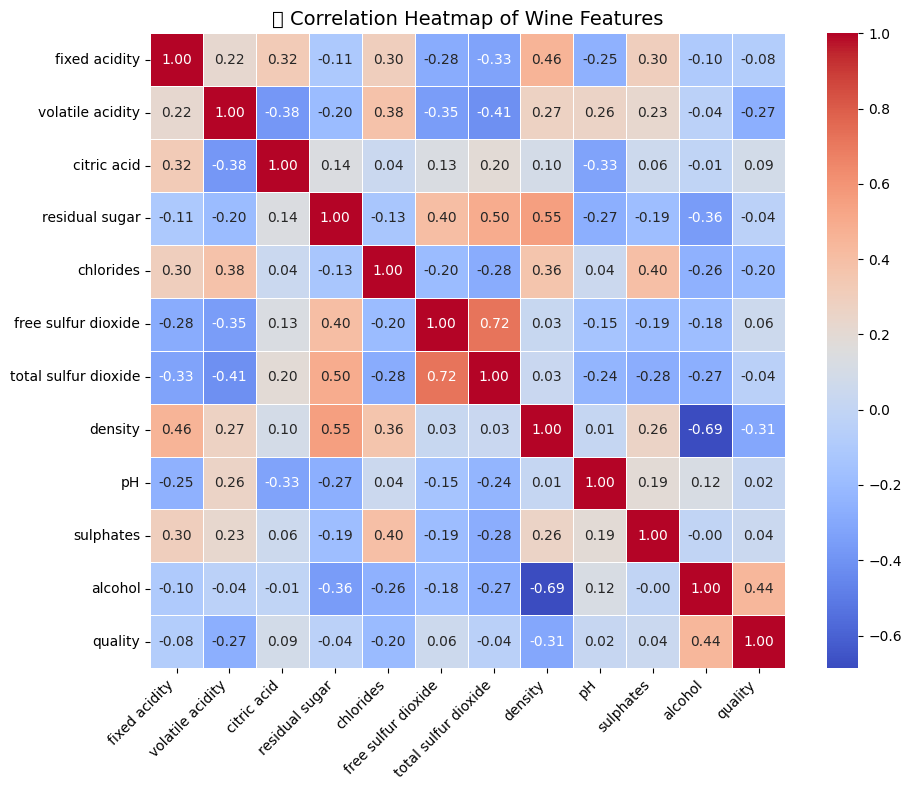

## 🍷 Wine Quality Analysis

This project performs **exploratory data analysis (EDA)** and **multidimensional visualizations** on the UCI Wine Quality dataset (Red & White wines).

## 📊 Features
- Data preprocessing & cleaning
- Statistical summary
- Multivariate analysis:
  - Correlation heatmap
  - Pairplot
  - 3D scatter plot
  - Parallel coordinates
  - Andrews curves
  - Radar chart
  - PCA & KMeans Clustering
 
## 📊 Analysis Visualizations

| Visualization | Description | Preview |
|---------------|-------------|---------|
|  | Data Distribution of Features |  |
|  | Correlation matrix of all features |  |
|  | Model performance confusion matrix |  |
|  | ROC Curve for binary classifier |  |
|  | Top 10 features influencing the model |  |
|  | Data Distribution of Features |  |
|  | Data Distribution of Features |  |
|  | Data Distribution of Features |  |
|  | Data Distribution of Features |  |
|  | Data Distribution of Features |  |
|  | Data Distribution of Features |  |


## 📁 Structure
- `data/`: CSV datasets
- `notebooks/`: Jupyter notebook with full EDA
- `src/`: Python scripts (optional modularization)
- `visuals/`: Saved plots/images

## 🚀 How to Run
1. Clone this repo  
2. Install dependencies:
   ```bash
   pip install -r requirements.txt
